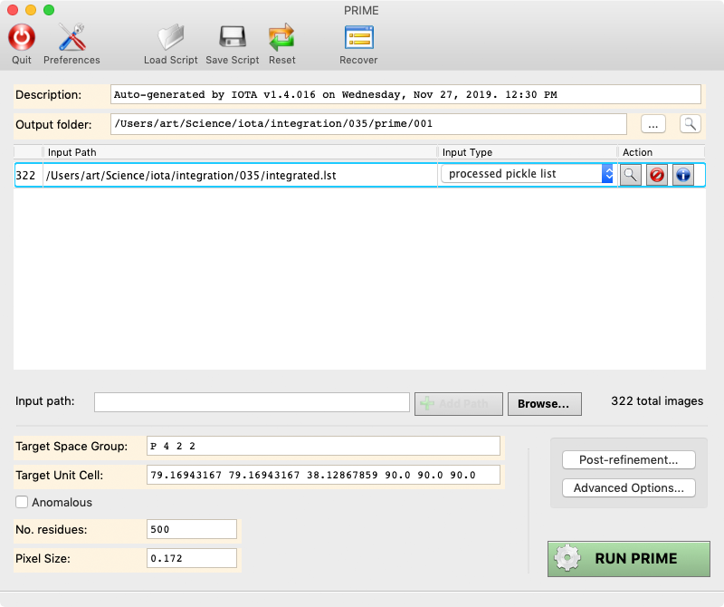
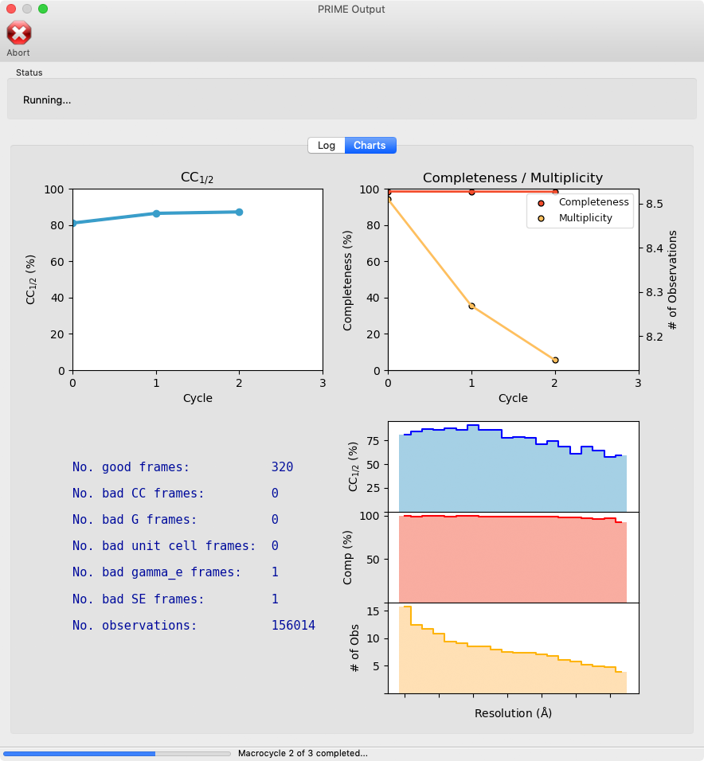

# PRIME: Post-Refinement and Merging

PRIME is a scaling, post-refinement, and merging program that contains several features key to processing serial X-ray diffraction datasets, such as

  1. An advanced initial scaling algorithm, where each frame is corrected against the Wilson plot of the initial merged dataset.
  2. A classical post-refinement algorithm, where each frame's orientation vector, unit cell dimensions, reflection partiality, etc. are corrected against the merged dataset, which is subsequently updated using the post-refined frames.
  3. An adaptation of the Brehm-Diederichs algorithm to resolve indexing ambiguities
  
These features enable the assembly of complete datasets from relatively small sets of images (~ 1000 or less, sometimes as few as 100, depending on the crystal symmetry). PRIME has been developed in parallel with IOTA; users can thus generate a seamless data processing pipeline by reducing the raw diffraction images with IOTA and subsequently merging with PRIME.

PRIME can be run as a GUI or from the command-line; scripts can be used for both, interchangeably. The command-line mode is useful if the program is run remotely on servers that do not, for some reason, support graphics.

# Reference

Please cite the following source article if using PRIME:

**[1]** Enabling X-ray Free Electron Laser Crystallography for Challenging Biological Systems from a Limited Number of Crystals. Uervirojnangkoorn M, Zeldin OB, Lyubimov AY, Hattne J, Brewster AS, Sauter NK, Brunger AT, Weis WI. Elife. 2015 Mar 17;4.

For an example of how the IOTA/PRIME pipeline was used to solve a structure from a small dataset, see

**[2]** Advances in X-ray free electron laser (XFEL) diffraction data processing applied to the crystal structure of the synaptotagmin-1 / SNARE complex. Lyubimov AY, Uervirojnangkoorn M, Zeldin OB, Zhou Q, Zhao M, Brewster AS, Michels-Clark T, Holton JM, Sauter NK, Weis WI, Brunger AT. Elife. 2016 Oct 12;5.

For a report on resolving the indexing ambiguity in serial diffraction data, see

**[3]** Resolving indexing ambiguities in X-ray free-electron laser diffraction patterns. Uervirojnangkoorn M, Lyubimov AY, Zhou Q, Weis WI, Brunger AT. Acta Crystallogr D Struct Biol. 2019 Feb 1;75(Pt 2):234-241.

## Disclaimer Notice

The items furnished herewith were developed under the sponsorship 
of the U.S. Government (U.S.).  Neither the U.S., nor the U.S. 
Department of Energy (D.O.E.), nor the Leland Stanford Junior 
University (Stanford University), nor their employees, makes any
warranty, express or implied, or assumes any liability or 
responsibility for accuracy, completeness or usefulness of any 
information, apparatus, product or process disclosed, or represents
that its use will not infringe privately-owned rights.  Mention of
any product, its manufacturer, or suppliers shall not, nor is it 
intended to, imply approval, disapproval, or fitness for any 
particular use.  The U.S. and Stanford University at all times 
retain the right to use and disseminate the furnished items for any
purpose whatsoever.                                 Notice 91 02 01

Work supported by the U.S. D.O.E under contract DE-AC03-76SF00515; 
and the National Institutes of Health, National Center for Research 
Resources, grant 2P41RR01209. 

